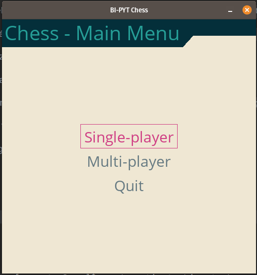
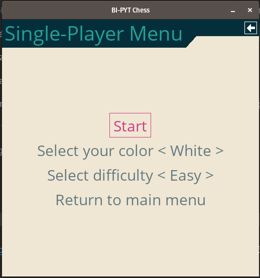
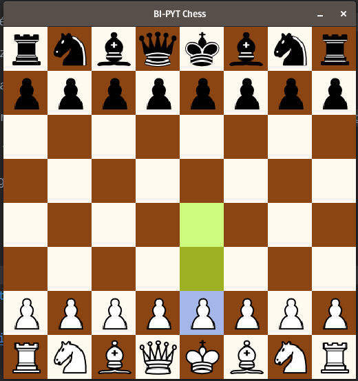
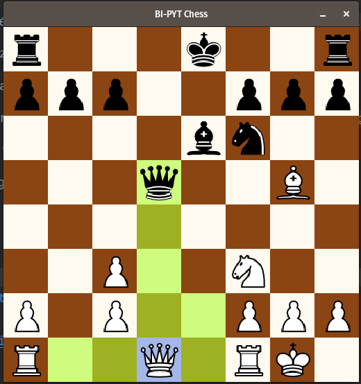

# BI-PYT Chess 

## Game images

## Report

[Click here to see the report of this project](hujomark.pdf)

## How to run

Pre inštaláciu potrebných závislostí je potrebné spustiť príkaz `conda env create -f environment.yml` a následne `conda activate bi-pyt-chess`.

Potom je ešte nutné nainštalovať knižnicu pygame-menu príkazom `pip install pygame-menu -U`.

Hra sa spustí príkazom `python main.py`.

Unit testy sa spustia príkazom `python -m pytest`.

Unit testy s vygenerovaním code coverage reportu sa spustia príkazom `coverage run -m pytest`.

Report si následne vieme pozrieť príkazom `coverage report`.

Report si vieme vygenerovať aj v HTML príkazom `coverage html`.
